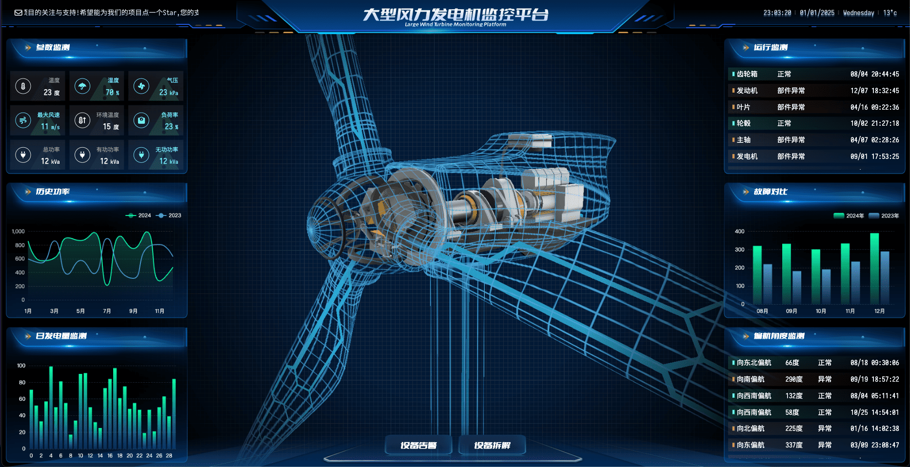

> 一个可视化数据大屏案例

<h1>
  
</h1>

### 大屏项目实现

#### Layout

1. 实现大屏项目的整体布局，设置布局容器，留出插槽
2. 两侧图表容器使用 absolute 定位

#### LayoutHeader

1. 图片为背景图片而不是 img 元素，可以放置子元素
1. 伪元素的使用
1. CSS 的背景图片属性使用
1. 文字滚动 CSS 动画

#### LayoutPanel

1. 封装图表容器组件
2. 图表容器的 header 和背景都是图片

#### WidgetPanel02 / useEcharts

1. 封装 echarts 使用的 hook，监听窗口 resize 事件。这里还可以用
   echarts-for-react 库

#### Widgetpanel06

1. CSS 列表循环滚动动画

### 实现大屏尺寸自适应

1. 最外层元素设置宽高 100%，配合 autofit.js 自动使用 scale 对页面进行缩放。

2. 图表容器的宽度使用的是 px 单位，有了 autofit.js 进行自动缩放后就可以使用设计
   图(1920\*1080)里的尺寸了。

### 大屏项目的两个优化点

#### 字体优化

完整的中文字体文件通常非常大（几 MB 到几十 MB）。通过对字体文件进行分包即将使用
到的中文拆成单独的字体文件，减小打包体积。

#### 图片优化

使用 vite-plugin-imagemin 库压缩图片

###### 图片优化：

必须做的：

1. 图片压缩，使用 vite-plugin-imagemin 插件
2. 懒加载，使用 img 的 loading="lazy" 或使用 Intersection Observer API 监听或者
   使用第三方库
3. 明确设置图片宽高，不然图片加载前后占据空间不同会导致重排；也可以设置宽高一边
   ，然后设置 ratio 属性，浏览器也会自动计算实际宽高。使用低质量图片或者背景色占
   位，提升用户体验。

推荐做的：

1. 根据屏幕尺寸选择不同图片，利用 img 元素的 srcset 属性
2. 优先使用 webp 格式图片
3. 将图片上传到 CDN
4. 雪碧图

### TODO

1. 熟悉自定义各种 echarts 图表样式
2. 定制化 echarts 里没有的图表
